## Goal #
root

## Download #
[https://www.vulnhub.com/entry/sunset-dawn,341/](https://www.vulnhub.com/entry/sunset-dawn,341/)

## Walkthrough #

**nmap**
 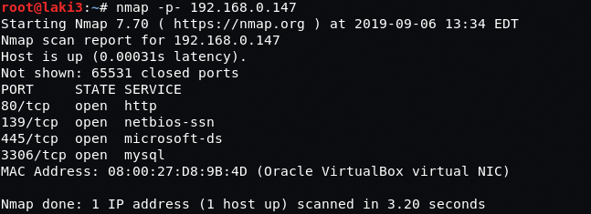
  

**default 80...nothing**
 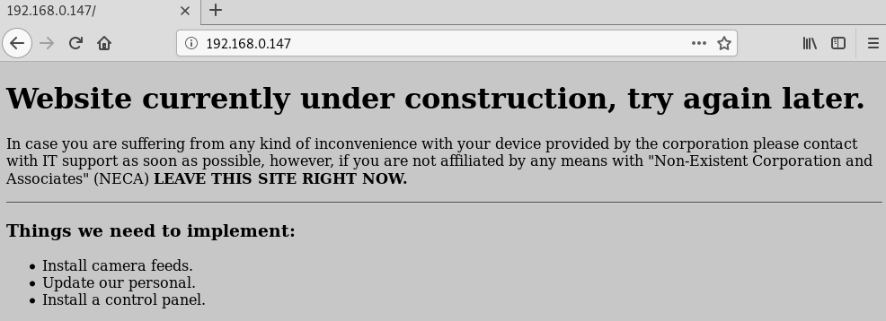
  

**dirb finds a log folder...only one is accessable**
 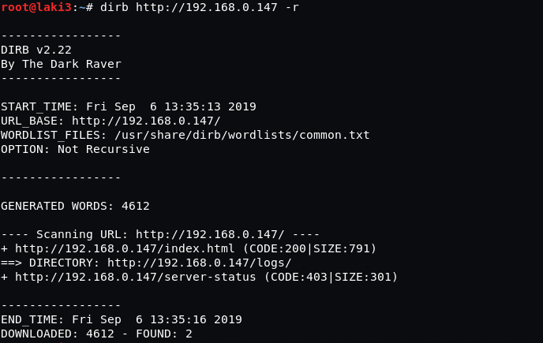
 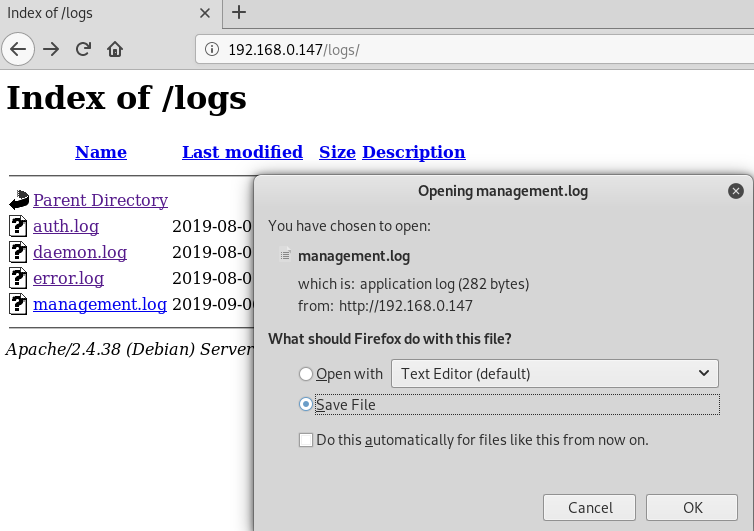
  

**log shows that some folders are being monitored**
 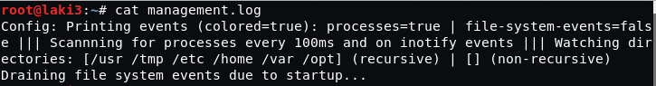
  

**enum4linux shows an interesting share and usernames**
 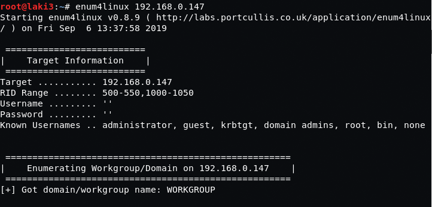
 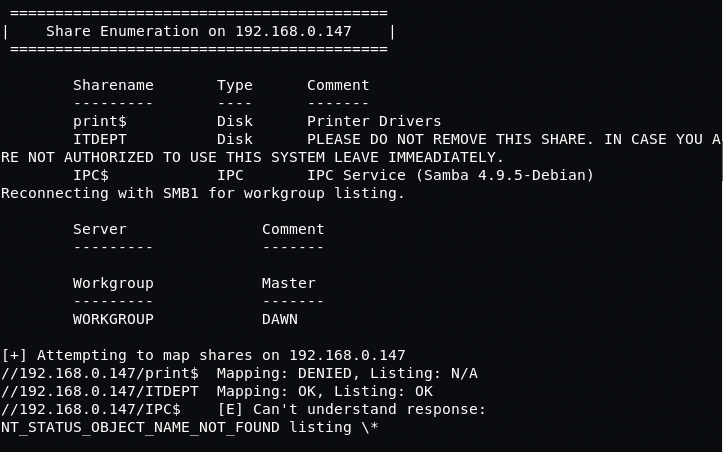
 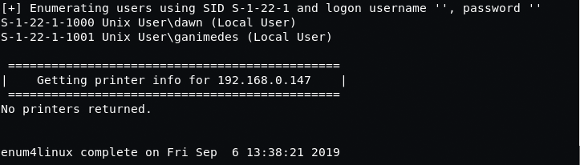
  

**connecting to smb share we can write to it**
 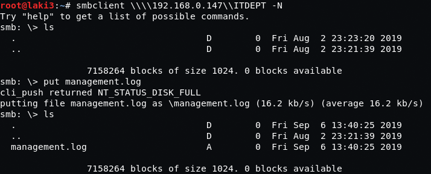
  

**got lost for some time as i couldn't find anything.  i rebooted the system and noticed the management.log grew in size...hmmmm**

**updated management log shows some processes are continually happening**
 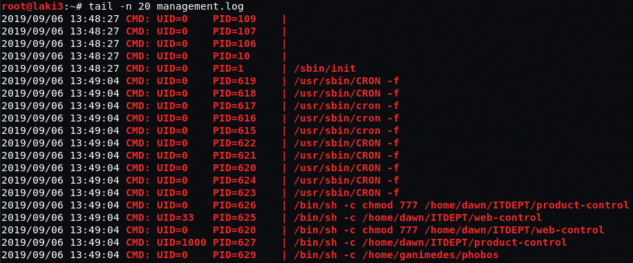
  

**created reverse shell file named web-control since it was being referenced in the log. setup listener and we have low priv access**
 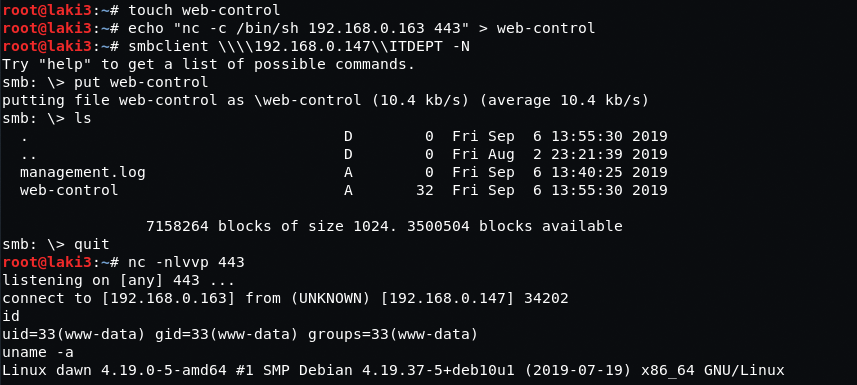
  

**we can sudo sudo with no password...and we have root**
 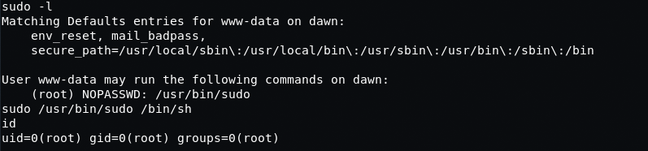
  

**and root flag**
 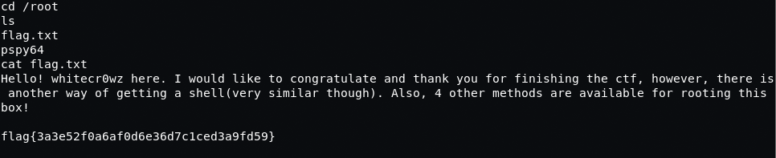
  
