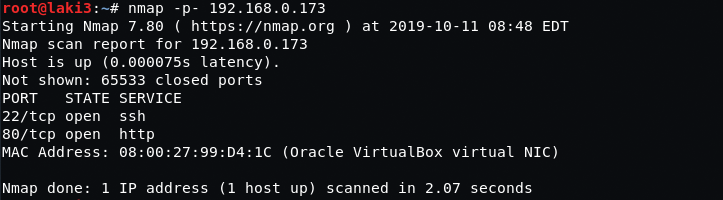
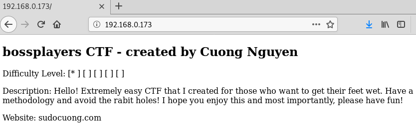
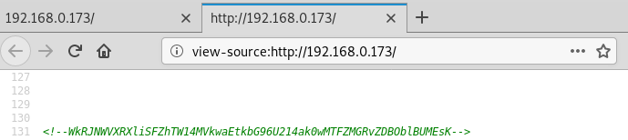
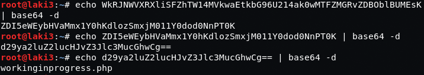
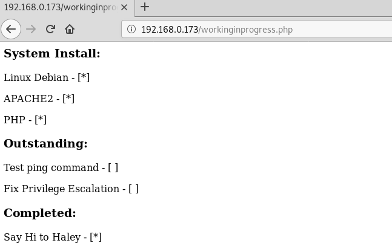
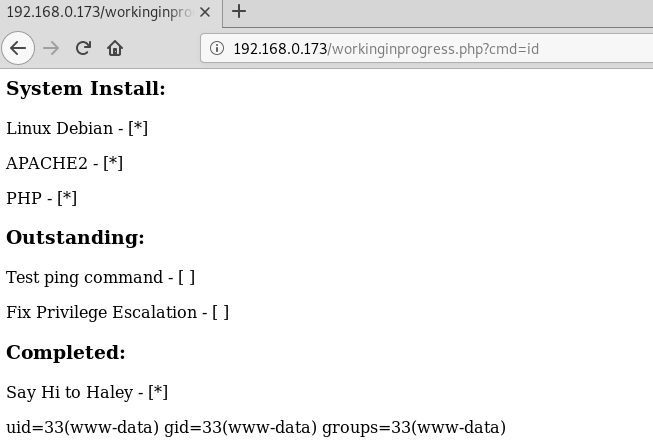
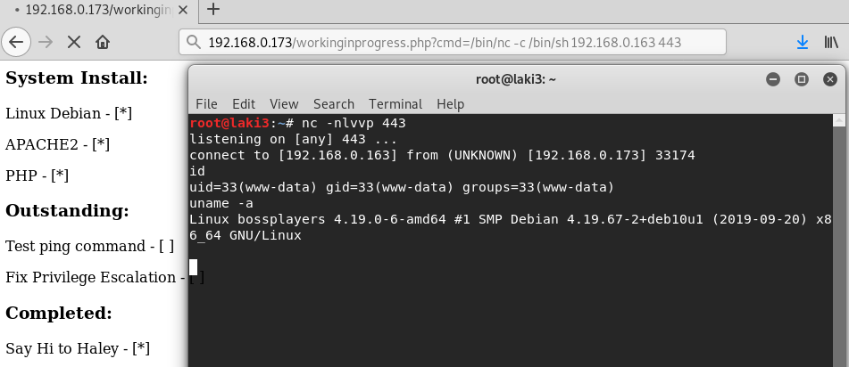
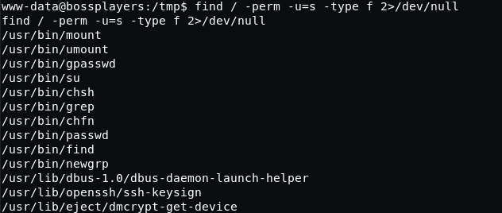
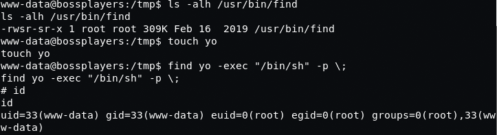
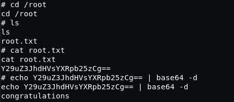

## Goal #
root

## Download #
[https://www.vulnhub.com/entry/bossplayersctf-1,375/](https://www.vulnhub.com/entry/bossplayersctf-1,375/)

## Walkthrough #

**nmap**
 
  

**default 80**
 
  

**base64 comment revealed in source**
 
  

**base64 decoded to site page**
 
  

**navigate to page and seems to point to rce**
 
  

**after testing various different words to trigger execution (command, ping, file)...cmd works**
 
  

**reverse shell achieved**
 
  

**after some searching looks suid 'find' seems likely**
 
  

**root**
 
  

**root flag**
 
  