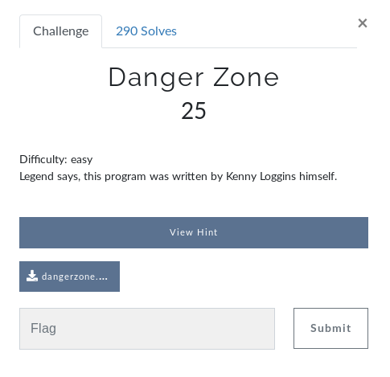
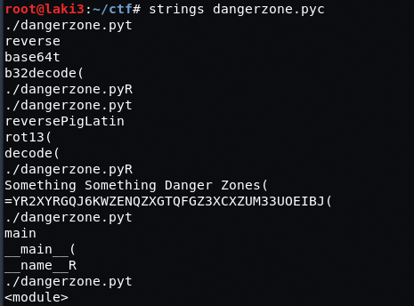
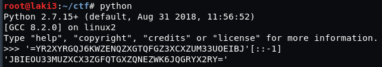
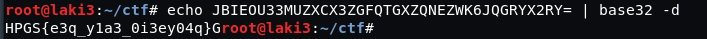
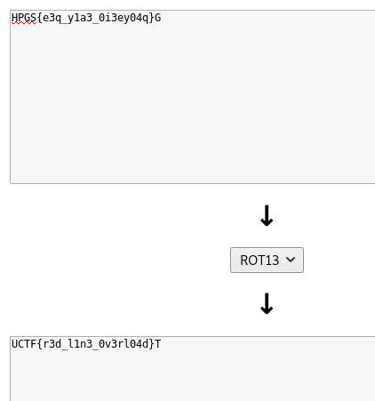

# Challenge #
 
  
# Solution #
**provide python file and found what looked to be a reverse base64 string**
 
  
**reversed it**
 
  
**ended up being a base32 string**
 
  
**converted from ROT13 revealed flag**
 

