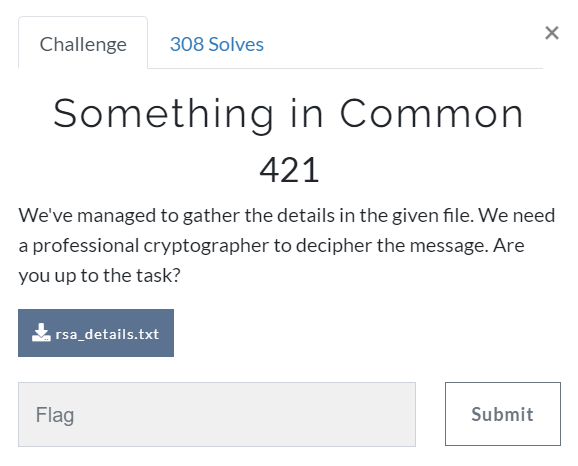

# Challenge #
 
  
# Solution #
<pre>
used script from </pre>[here](https://medium.com/bugbountywriteup/rsa-attacks-common-modulus-7bdb34f331a5) <pre>with values in .txt file

TUCTF{Y0U_SH0ULDNT_R3US3_TH3_M0DULUS}
</pre>

