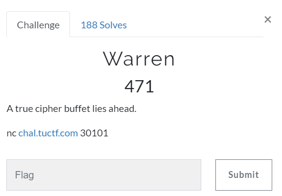

# Challenge #
 
  
# Solution #
<pre>
90 seconds to decode 5 different ciphers: Affine/Baconian/Caesar/Atbash/Vigenere
Lined up decode sites and entered as fast as possible

TUCTF{th4nks_f0r_d1n1ng_4641n_4t_th3_W4rr3n_buff3t}
</pre>

