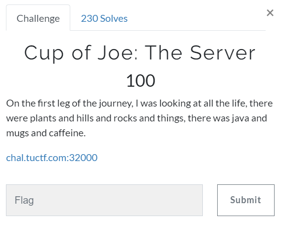

# Challenge #
 
  
# Solution #
<pre>
Site had linke to gif at /coffeepot, but there was a comment in source stating they really wanted tea

In Burp, noticed HTCPCP/1.0 and looked up [rfc2324](https://tools.ietf.org/html/rfc2324)

Paused Burp when trying /teapot and switched from GET to BREW

Returned, HTCPCP/1.0 418 I'm a teapot. Go to /broken.zip

Downloaded and there were two files; broken.img and flag.txt

TUCTF{d0_y0u_cr4v3_th3_418}
</pre>

