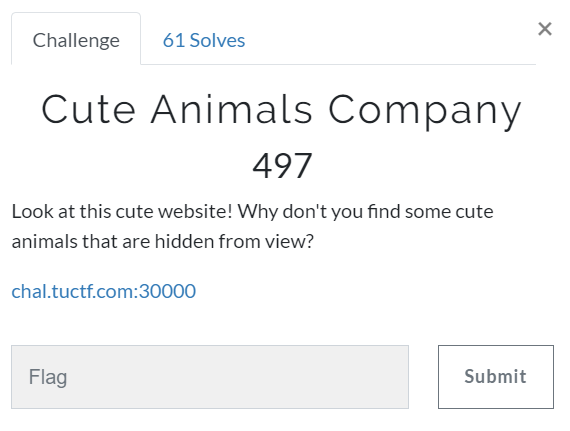

# Challenge #
 
  
# Solution #
<pre>
Cookie had Base64 'allowed=' field that stated false

Changed in Burp to true

dirb using burp found portal.php

lfi found on portal.php and flag found in /etc/passwd

used following for flag: http://chal.tuctf:30000/portal.php?file=/./././././././././././etc/passwd

TUCTF{m0r3_cut3_4n1m415_c4n_b3_f0und_4t_https://bit.ly/1HU2m5Q}
</pre>

