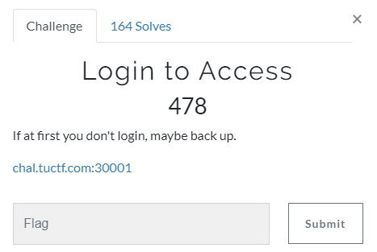

# Challenge #
 
  
# Solution #
<pre>
sql injection revealed actual login login.html 
	' or '1' = '1  
	
Used hint from challennge and dirb to find login.php.bak file which revealed flag

TUCTF{b4ckup5_0f_php?_1t5_m0r3_c0mm0n_th4n_y0u_th1nk} 
</pre>

