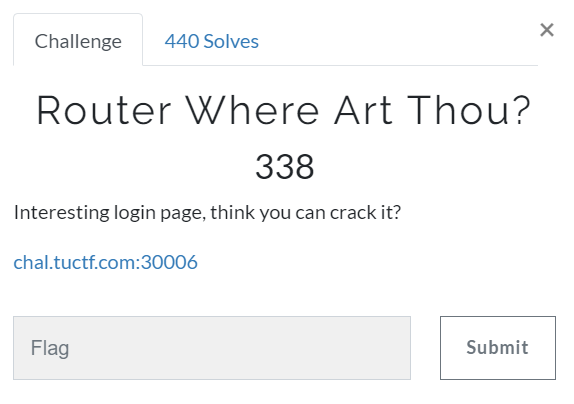

# Challenge #
 
  
# Solution #
<pre>
Started off here with a form at file 0.html
Tried 1.html and sonicwall login revealed
Tried 2.html file and palo login revealed
	admin:admin worked
	
TUCTF{y0u_f0und_th3_fun_r0ut3r_d3f4ult5}
</pre>

