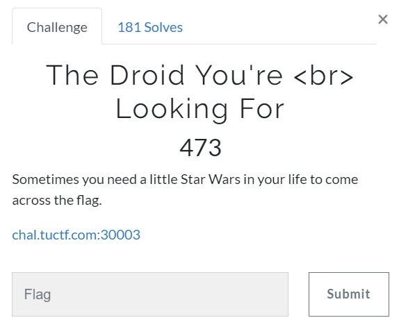

# Challenge #
 
  
# Solution #
<pre>
dirb found /robots.txt

new directory 'googleagentflagfoundhere.html' listed

needed to change browser agent to User-Agent: Mozilla/5.0 (compatible; Googlebot/2.1; +http://www.google.com/bot.html)

TUCTF{463nt_6006l3_r3p0rt1n6_4_r0b0t}
</pre>

