# DC416: 2016 (Dick Dastardly)

## Goal 
Capture all 4 flags in flag{} format

## Download 
[https://www.vulnhub.com/entry/dc416-2016,168/](https://www.vulnhub.com/entry/dc416-2016,168/)

## Walkthrough 
Initial nmap reveals ssh on 22, web server running on 80 and irc on 6667
 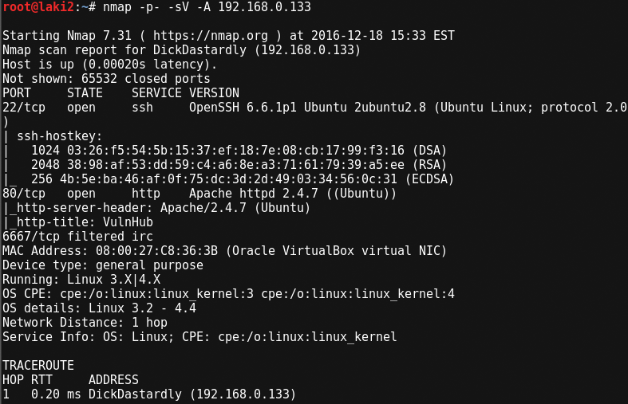
  

Running dirb against site shows two separate index pages, index.html and index.php
 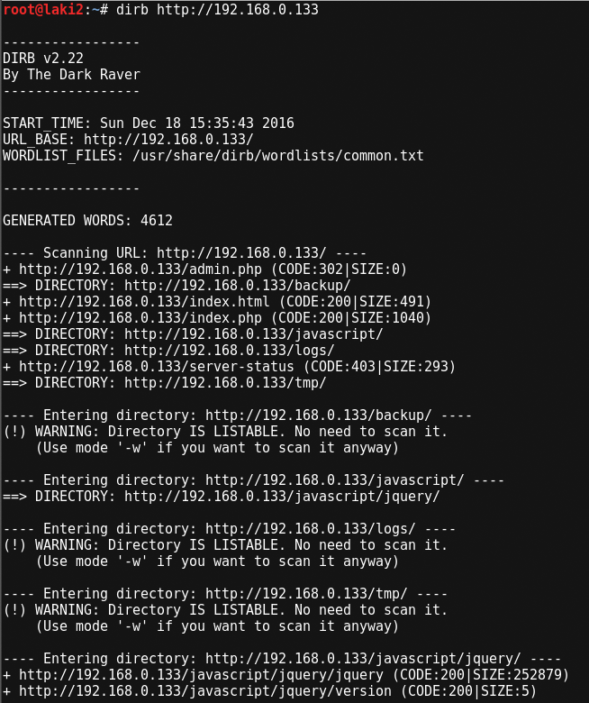
  

index.html is the default DC416 rules
 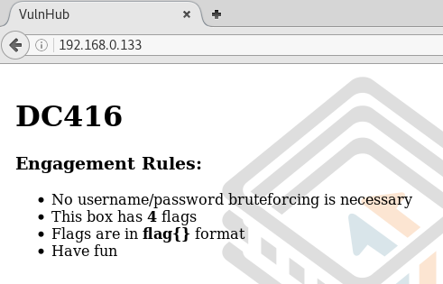
  

index.php shows a guestbook and login area
 
  

Preparing the site to run through burp suite to attempt a SQLi attack, flag 1 is revealed
 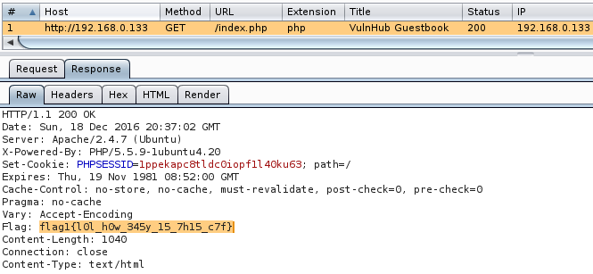
  
flag1{l0l_h0w_345y_15_7h15_c7f}

With no known credentials, I setup burp to run a SQLi attack
 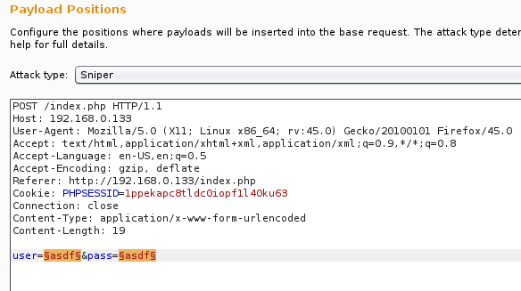
  

After a short while, a payload of  ' or 0=0 # is revealed and shows admin is logged into the site
 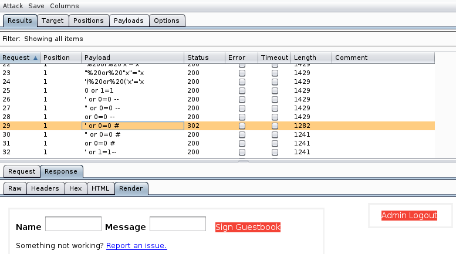
  

Using the SQLi payload on index.php, admin.php page is revealed
 
  

With three options, I decide to act on all of them
Adding IP to IRC whitelist simply refreshes the page, but burp shows a post to activate
 
  

I add a simple supybot owner with username yoyo and password 1234
 
  

After adding a user, I activate supybot
 
  

Knowing IRC port is open, I attempt connecting using irssi with command /connect 192.168.0.133 and it's successful
 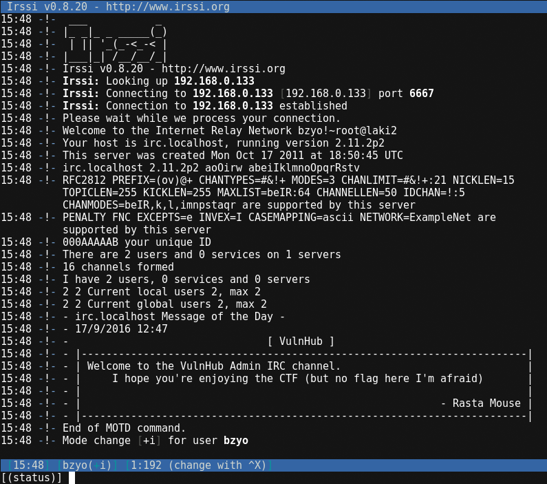
  

No channels or users are known, so I send a /list command which reveals the channel #vulnhub
 
  

Joining the channel reveals the user vulnhub-bot
 
  

Using the added username yoyo, I message the user with /msg vulnhub-bot user identify yoyo 1234 and it's successful
 
  

Running list reveals various commands that can be run including unix shell which allows system access, directory listing and reveals flag 2
 
  
flag2{y0u'r3_4_5upyb07_n00b_m8}

Being able to run system commands I attempt a reverse shell...
 
  

...and it's successful
 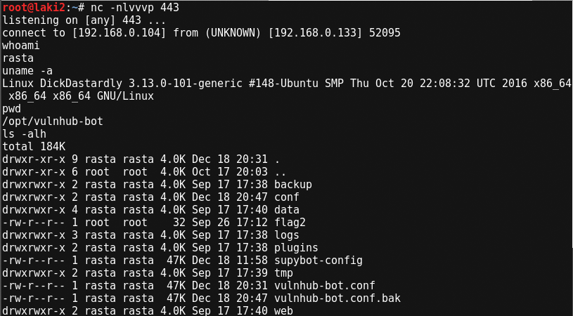
  

Some initial file enumeration shows a file xss.js stores the credentials for the admin.php page
 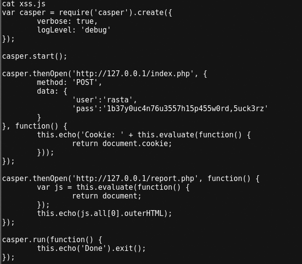
  
rasta:1b37y0uc4n76u3557h15p455w0rd,5uck3rz

Some additional enumeration shows mysql root credentials by running crontab -l
 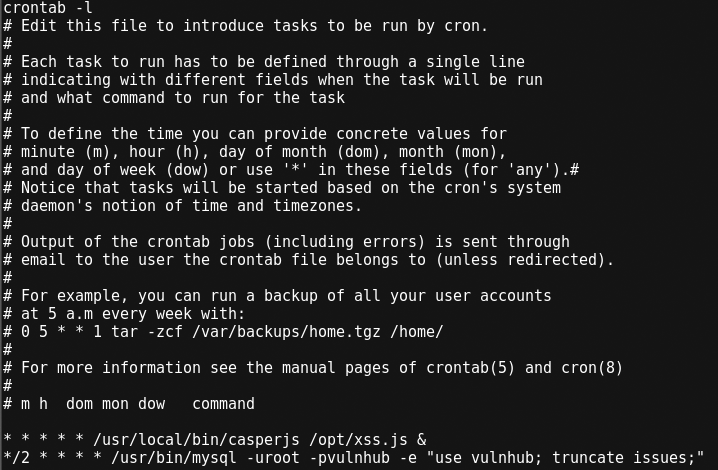
  
root:vulnhub

Using the mysql credentials reveals nothing special
 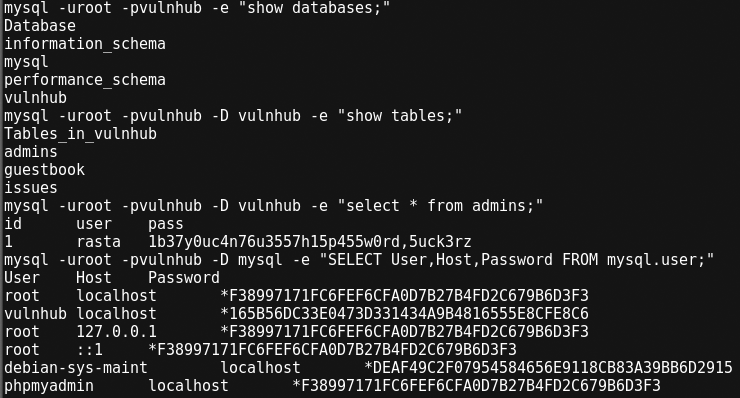
  

Additional enumeration by running ps -aux reveals an interesting ping command being run as root with a pattern (-p) option
 
  

After running ps -aux several other times it seems that the pattern changes every so often
 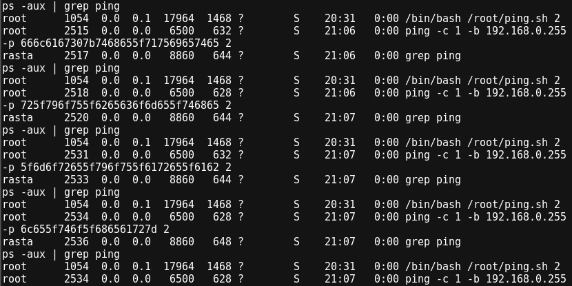
  

I start wireshark and notice icmp traffic from the system. Filtering traffic to icmp only reveals the ping pattern seen from ps -aux. Each packet has text data which when put together reveals flag 0

flag0{the_quiete
 
  

r_you_become_the
 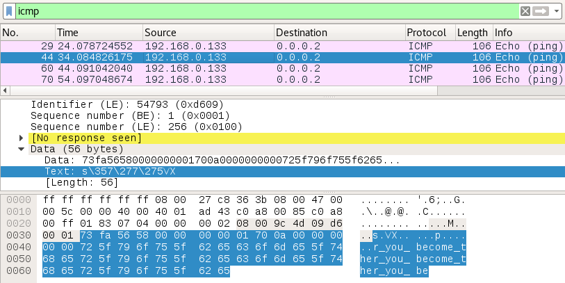
  

_more_you_are_ab
 
  

le_to_hear}
 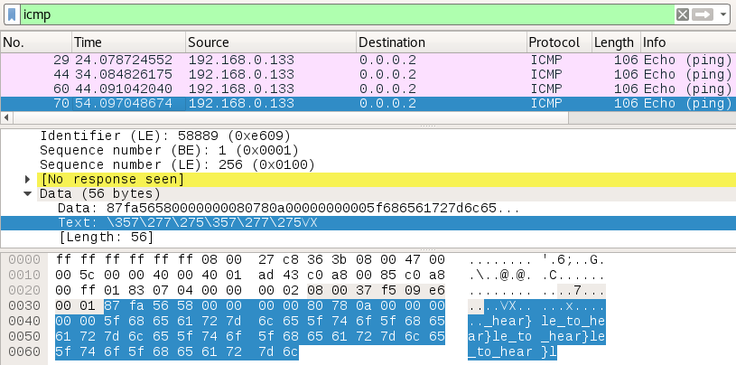
  

flag0{the_quieter_you_become_the_more_you_are_able_to_hear}
So now I only have one additional flag as they apparently started at zero :)

Additional enumeration shows that current user rasta can sudo as vulnhub with no password for a specific command
 
  

Running the command reveals nothing as it's a limited shell. After many various attempts, the letter q actually quits the program and reveals the menu
 
  

Option 1 reveals the user, which is vulnhub, Option 2 didn't do anything at first, but after several attempts it seems you have to specify the directory you would like listed. This reveals that /home/vulnhub holds the last flag
 
  

Option 3 actually holds coffee :)
 
  

After several failed attempts, I found the correct way to reveal flag 3
 
  

flag3{n3x7_71m3_54n17153_y0ur_1npu7}
