# BTRSys: v2.1

## Download
[https://www.vulnhub.com/entry/btrsys-v21,196/](https://www.vulnhub.com/entry/btrsys-v21,196/)

## Goal 
uid=0(root) gid=0(root) groups=0(root)

## Walkthrough
Initial nmap reveals ports on 21, 22, and 80
 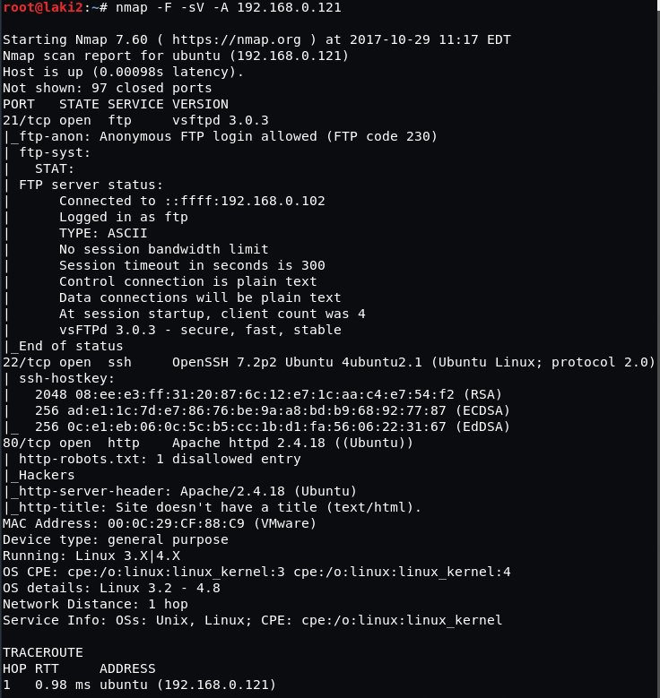
  

Nothing special on web page or in the source
 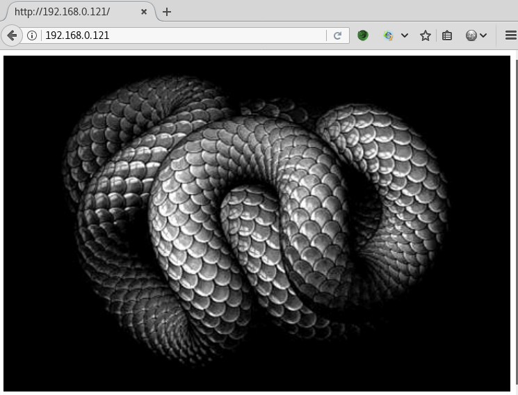
  

robots.txt reveals a wordpress instance
 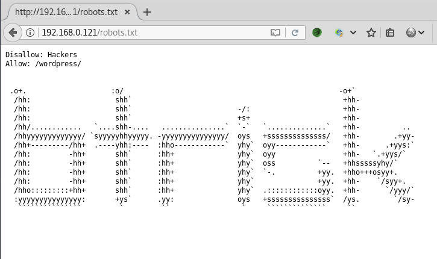
  

Crude implementation of wordpress and nothing special after some enumeration
 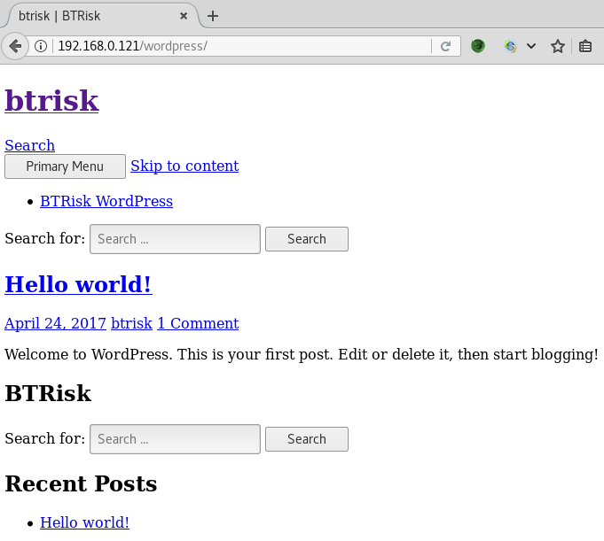
  

Throwing it at wpscan it reveals an older version with lots of vulns, but I suspect it's a ruse
 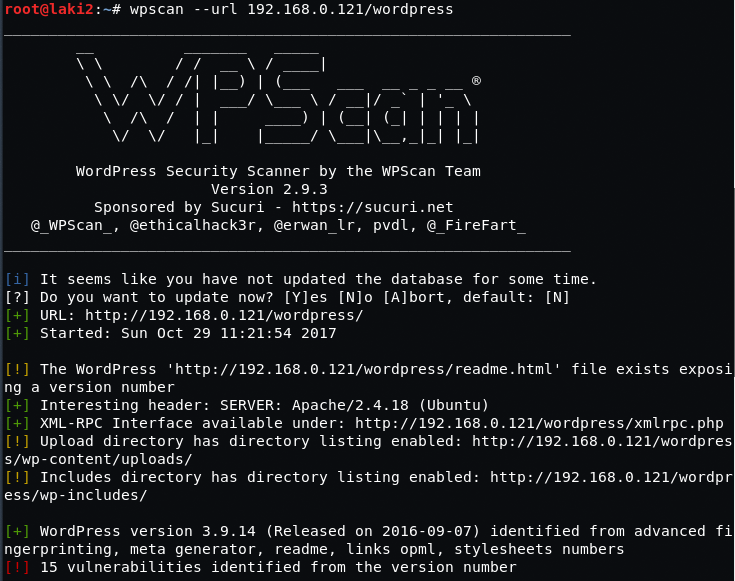
  

Enumerating users we find btrisk and admin
 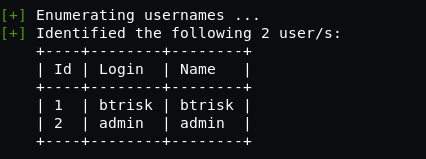
  

Brute forcing admin using wpscan reveals admin is the password as well
 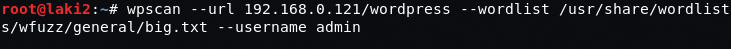
  

We're able to login to wordpress
 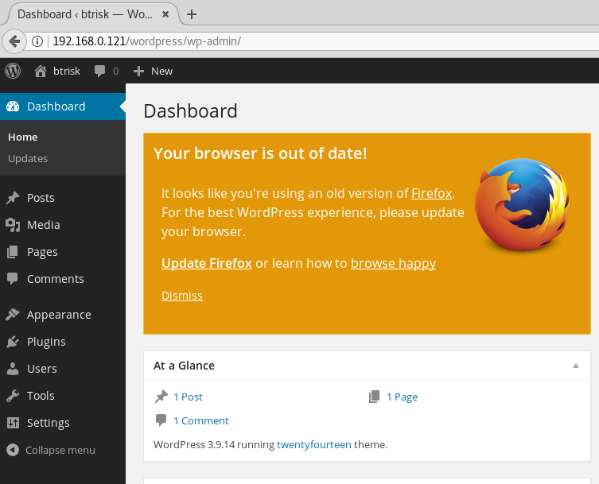
  

First thing is to get our php reverse shell into footer.php and haha! Someone already left one on the style.css page. Not sure if this was intentional or not...
 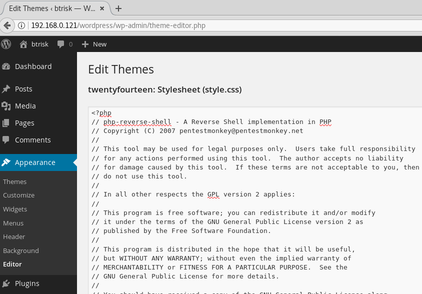
  

After prepping netcat, we pull up the wordpress instance and we have a reverse shell and confirm username btrisk
 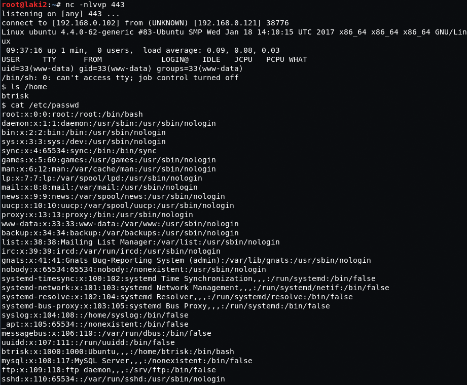
  

Couldn't find much on enumeration so I grab mysql root password from wp-config.php
 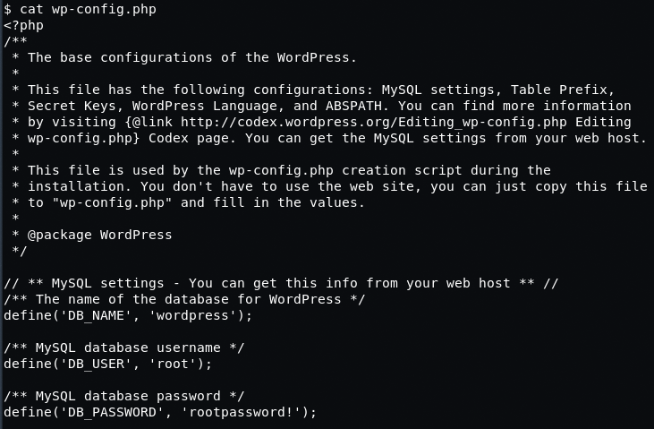
  

Next we dump the wordpress database using mysql oneliners revealing usernames and passwords
 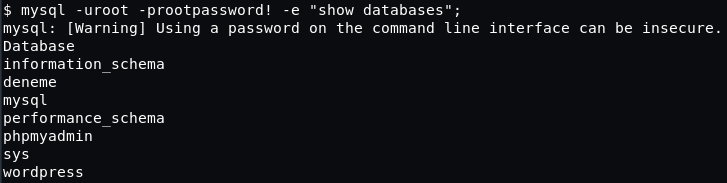
 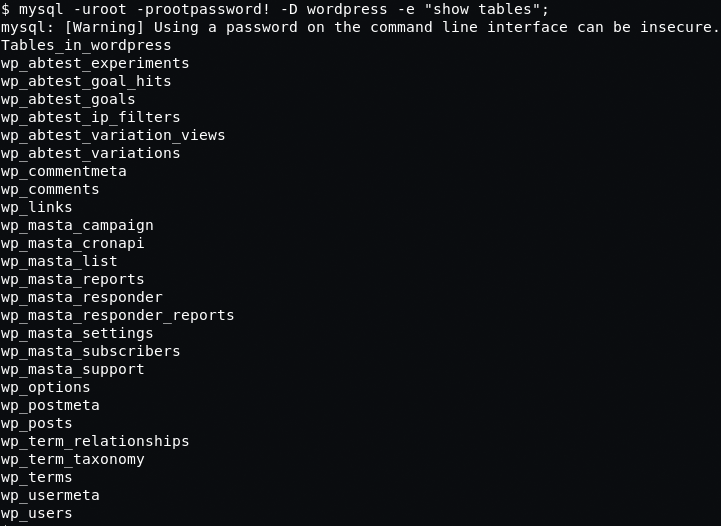
 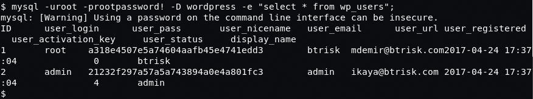
  

We throw the hash for btrisk at findmyhash and a password is revealed
 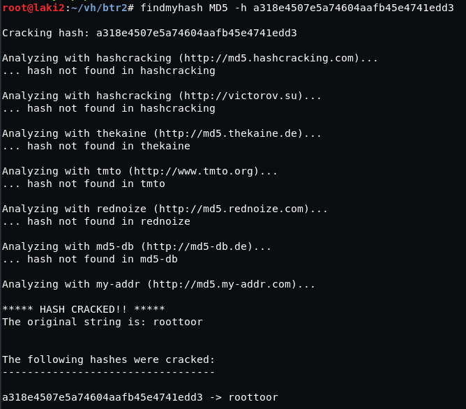
  

We're able to ssh using the username btrisk and the found password
 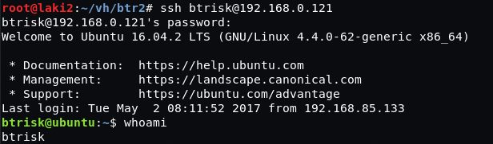
  

Simple sudo -i elevates us to root
 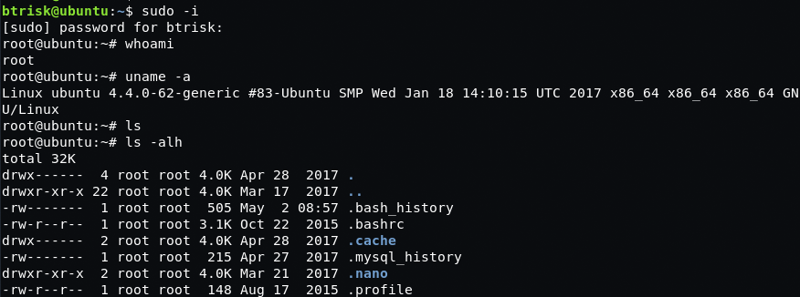
  