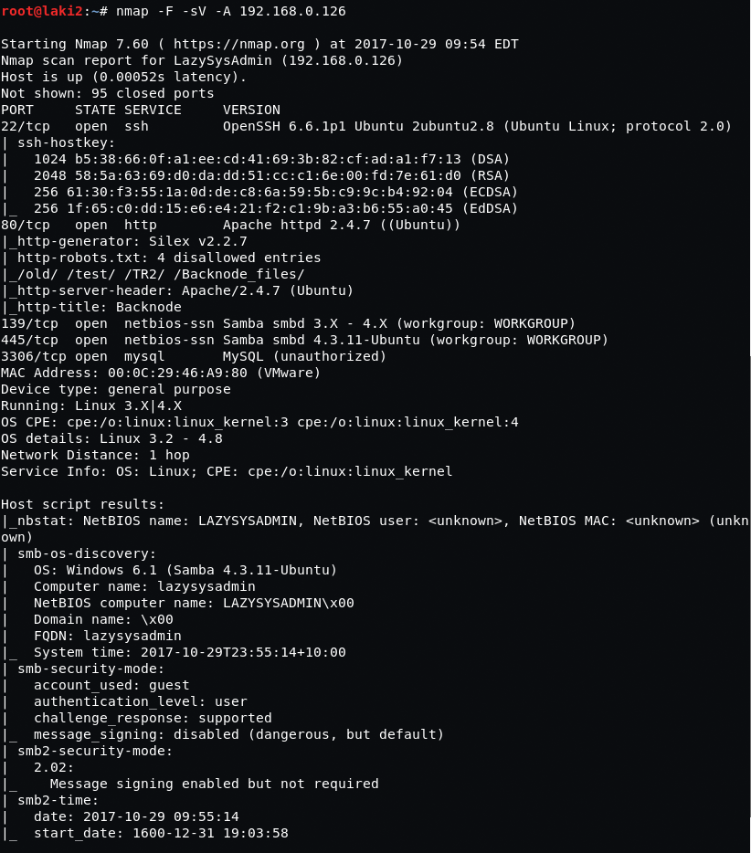
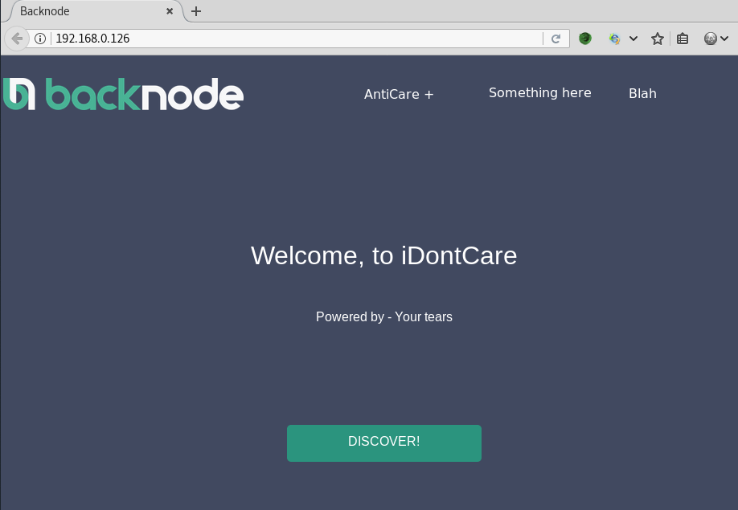
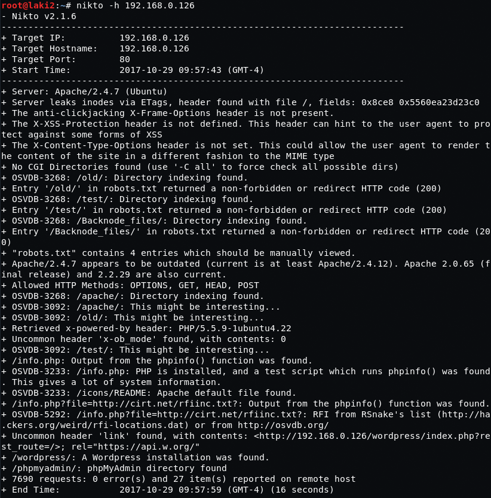
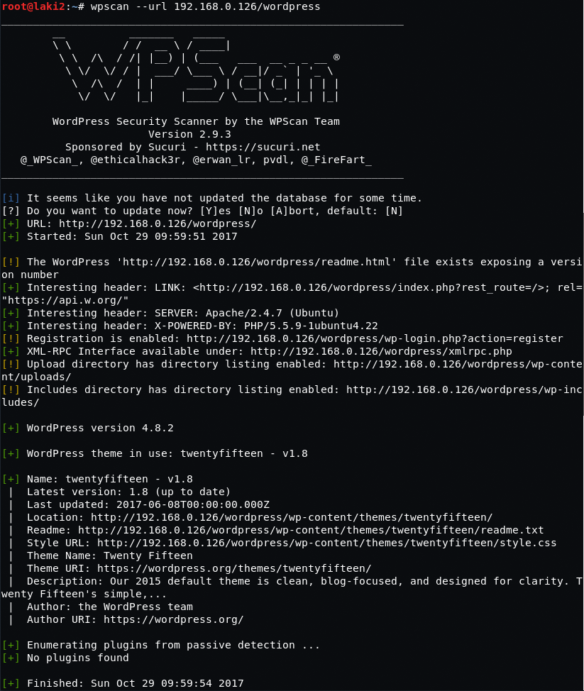
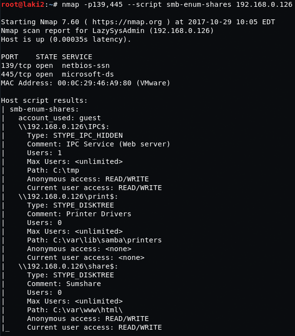
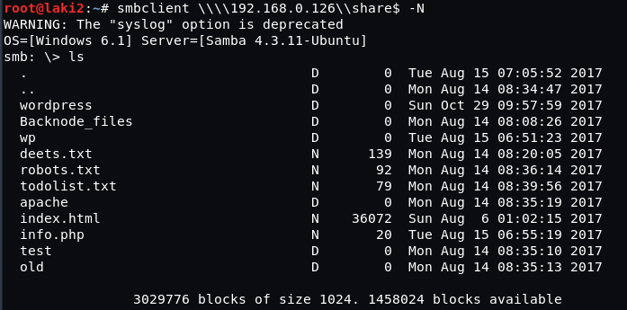
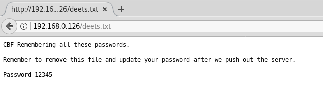
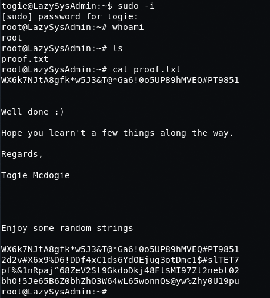

# LazySysAdmin: 1

## Goal
uid=0(root) gid=0(root) groups=0(root)

## Download 
[https://www.vulnhub.com/entry/lazysysadmin-1,205/](https://www.vulnhub.com/entry/lazysysadmin-1,205/0)

## Walkthrough 
Initial nmap shows ports open on 22, 80, 139, 445 and 3306
 
  

Nothing special with web page as the links don't work and nothing in source
 
  

nikto reveals a wordpress instance and after some enumeration the most we got was a username 'togie'
 
  

wpscan reveals latest version of wordpress nothing more after further enumeration
 
  

Went back to open smb ports and enumerated open shares using nmap script
 
  

Using smbclient we're able to get full read-only access to www folder and it shows a file deets.txt
 
  

Opening deets.txt up in a browser reveals a password
 
  

Using that password with found username togie, we have a shell
 
  

Simple sudo -i elevates us to root
 
  